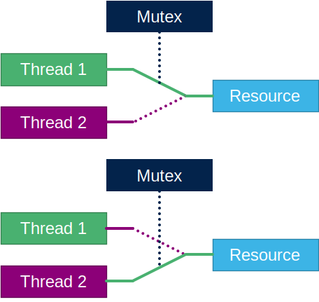
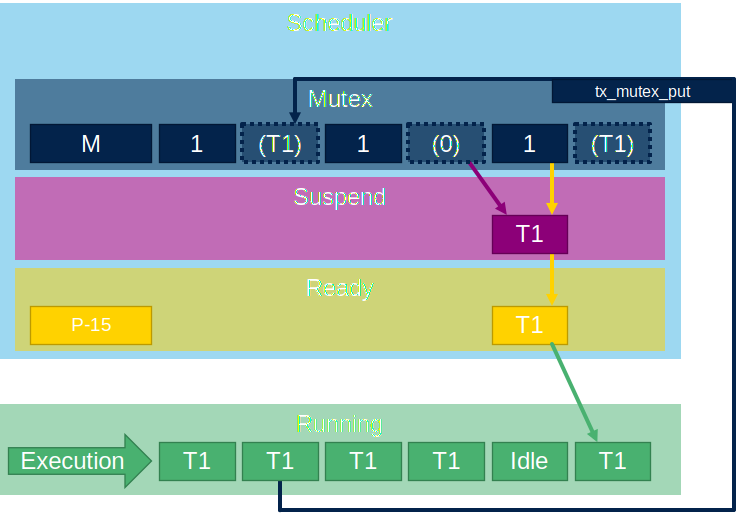
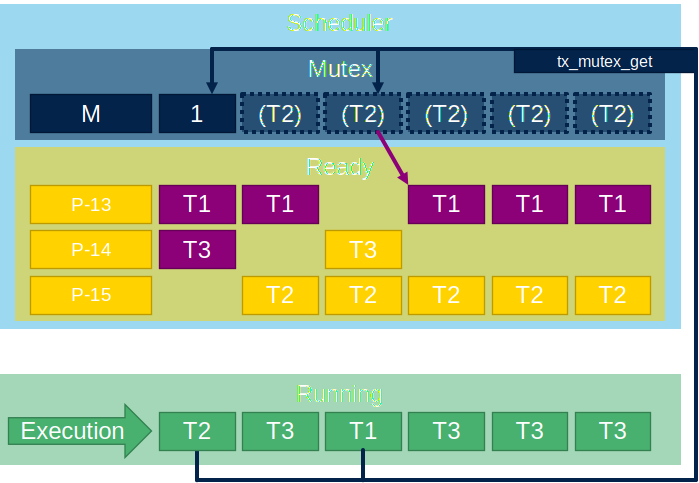
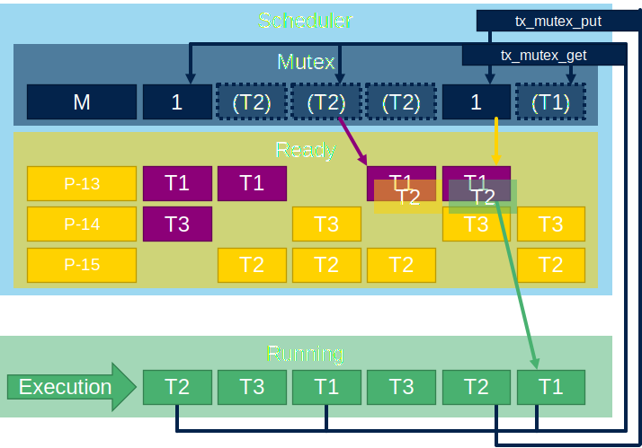

# Mutex

Mutex is ery similar to sempahore but conts onely to 1.
Also mute have one spetial behaviour which differ from semaphore and that is priority inherience. Where thread owning mutex will have increased priority to same level as thread waiting for this mutex.



## Mutex creation

Mutex is created by function `tx_mutex_create`. First parameter is mutex handle

```c
TX_MUTEX mutex_ptr;
```

Second parameter is mutex name `"my_mutex"`. Third parameter is priority inherience option. `TX_NO_INHERIT` With this mutex is behaving as binary semaphore. `TX_INHERIT` mutex can inherit priority of waiting thread.

```c
tx_mutex_create(&mutex_ptr,"my_mutex", TX_INHERIT);
```

## Mutex get

Mutex get is similar to queue we will use `tx_mutex_get`.
First parameter is mutex handle `mutex_ptr` second is waiting time from TX_NO_WAIT(0x0) to TX_WAIT_FOREVER(0xFFFFFFFF).

As example mutex is protecting the GPIO to give access only one thread.

```c
VOID my_thread_entry (ULONG initial_input)
{
	tx_thread_sleep(15);
	while(1){
		tx_mutex_get(&mutex_ptr,TX_WAIT_FOREVER);
		HAL_GPIO_TogglePin(PIOB, GPIO_PIN_0);
		tx_mutex_put(&mutex_ptr);
		tx_thread_sleep(15);
	}
}
```


## Mutex put

Mutex put will allow mutex to be used by other threads and wake up waiting suspended threads.
It use `tx_mutex_put` with mutex handle as parameter `mutex_ptr`
Same example as in mutex get part.

```c
VOID my_thread_entry (ULONG initial_input)
{
	tx_thread_sleep(15);
	while(1){
		tx_mutex_get(&mutex_ptr,TX_WAIT_FOREVER);
		HAL_GPIO_TogglePin(PIOB, GPIO_PIN_0);
		tx_mutex_put(&mutex_ptr);
		tx_thread_sleep(15);
	}
}
```



## Mutex priority inherience

Here we have an example of three threads. T1 prority 13,T2 priority 15,T3 priority 14.
At beginning T2 will get mutex. After while the T3 is resumed and because have bigger priroity it will preempty T2. After some time T1 is ready and will try to take mutex. But this will be not possible because it is owned by T2. So T1 will suspend. But T2 will newer continue because it is preempted by T3. So only T3 will run.



This we can solve by using `TX_INHERIT` when we creating out mutex.
As result when T1 is resumed and take mutex. It will again suspend T1 but T2 will get same priority as T1. So T2 can finish job. Return mutex. And T1 will be resumed and can work.



Complete example is here. The mutex is blocked for purpose, this is not correct way how to handle mutex it is only for demonstrative purpose to be visible in TraceX.

```c
/* USER CODE BEGIN PV */
#define THRAD_STACK_SIZE 1024
uint8_t thread_stack[THRAD_STACK_SIZE];
uint8_t thread_stack2[THRAD_STACK_SIZE];
uint8_t thread_stack3[THRAD_STACK_SIZE];
TX_THREAD thread_ptr;
TX_THREAD thread_ptr2;
TX_THREAD thread_ptr3;
TX_MUTEX mutex_ptr;
uint32_t ret_val;
/* USER CODE END PV */

/* Private function prototypes -----------------------------------------------*/
/* USER CODE BEGIN PFP */
VOID my_thread_entry (ULONG initial_input);
VOID my_thread_entry2 (ULONG initial_input);
VOID my_thread_entry3 (ULONG initial_input);
/* USER CODE END PFP */

UINT App_ThreadX_Init(VOID *memory_ptr)
{
  UINT ret = TX_SUCCESS;
  TX_BYTE_POOL *byte_pool = (TX_BYTE_POOL*)memory_ptr;

  /* USER CODE BEGIN App_ThreadX_Init */
  ret_val = tx_thread_create(&thread_ptr, "my_thread",
      my_thread_entry, 0x1234,
	  thread_stack, THRAD_STACK_SIZE,
      13, 13, 1,
      TX_AUTO_START);
  ret_val = tx_thread_create(&thread_ptr2, "my_thread2",
      my_thread_entry2, 0x1234,
	  thread_stack2, THRAD_STACK_SIZE,
      15, 15, 1,
      TX_AUTO_START);
  ret_val = tx_thread_create(&thread_ptr3, "my_thread3",
      my_thread_entry3, 0x1234,
	  thread_stack3, THRAD_STACK_SIZE,
      14, 14, 1,
	  TX_DONT_START);

  //tx_mutex_create(&mutex_ptr,"my_mutex", TX_INHERIT);//use to inherit priority
  tx_mutex_create(&mutex_ptr,"my_mutex", TX_NO_INHERIT);//use to not inherit priority
  /* USER CODE END App_ThreadX_Init */
  return ret;
}

/* USER CODE BEGIN 1 */


VOID my_thread_entry (ULONG initial_input)
{
	tx_thread_sleep(15);
	while(1){
		tx_mutex_get(&mutex_ptr,TX_WAIT_FOREVER);
		HAL_GPIO_TogglePin(PIOB, GPIO_PIN_0);
		tx_mutex_put(&mutex_ptr);
		tx_thread_sleep(15);
	}
}

VOID my_thread_entry2 (ULONG initial_input)
{
	while(1){
		tx_mutex_get(&mutex_ptr,TX_WAIT_FOREVER);
		tx_thread_resume(&thread_ptr3);
		HAL_Delay(200);
		HAL_GPIO_TogglePin(GPIOE, GPIO_PIN_1);
		tx_mutex_put(&mutex_ptr);
	}
}

VOID my_thread_entry3 (ULONG initial_input)
{
	tx_thread_sleep(10);
	while(1){
		HAL_Delay(200);
	}
}
/* USER CODE END 1 */
```
